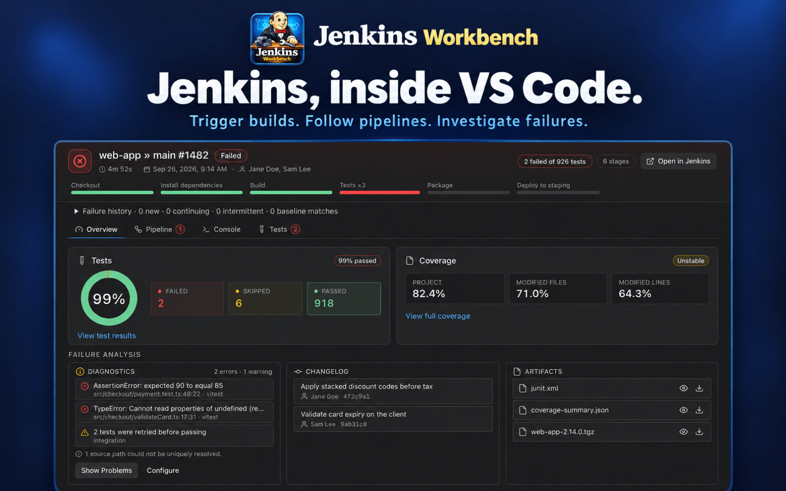

# Jenkins Workbench



[](https://github.com/Airizom/jenkins-workbench/actions/workflows/ci.yml)
[](https://github.com/Airizom/jenkins-workbench/actions/workflows/release.yml)
[](https://marketplace.visualstudio.com/items?itemName=airizom.jenkins-workbench)
[](https://open-vsx.org/extension/airizom/jenkins-workbench)
[](LICENSE)
[](https://code.visualstudio.com/)

VS Code extension that brings Jenkins into your editor. Browse jobs, trigger builds, stream console logs, watch for status changes, and manage CI/CD pipelines without leaving VS Code.

[Changelog](CHANGELOG.md) · [Report an Issue](https://github.com/Airizom/jenkins-workbench/issues)

## Features

### Browse & Navigate

- **Activity Bar View** — Dedicated Jenkins sidebar with a hierarchical tree view
- **Multi-Environment Support** — Connect to multiple Jenkins instances with workspace or global scope
- **Browse Everything** — Explore folders, multibranch pipelines, jobs, builds, and nodes
- **Activity View** — See jobs awaiting input, failing, unstable, or running without digging through folders
- **Curated Jenkins Views** — Browse Jenkins views in a dedicated section and hide noisy defaults
- **Go to Job...** — Quick search across all configured Jenkins environments
- **Pin Jobs & Pipelines** — Keep critical items in a top-level pinned section for quick access
- **Node Capacity** — Inspect executor utilization, queued work, offline impact, and label bottlenecks across an environment
- **Open Nodes in Jenkins** — Jump from node items directly to their Jenkins page
- **Deep Links** — Open builds and jobs through supported VS Code extension URIs (`vscode://airizom.jenkins-workbench/...`)
- **Summary Badges** — Running, queued, and watch-error counts displayed on tree sections

### Current Branch Workflow

- **Repository Linking** — Link a local Git repository to a Jenkins multibranch pipeline
- **Persistent Repository Links** — Links are keyed to the repository path and stored on the local machine, so the same checkout reuses its link in any workspace
- **PR-Aware Resolution** — Prefer the active GitHub pull request job (for example `PR-123`) when the GitHub Pull Requests extension can resolve one
- **Status Bar Summary** — See current-branch Jenkins status in the VS Code status bar
- **Current Branch Actions** — Open the resolved Jenkins job, trigger builds, inspect the latest build, or relink without browsing the tree

### Build Management

- **Trigger Builds** — Start builds with support for parameterized jobs (strings, booleans, choices, passwords, credentials, run, file, text, multi-choice)
- **Reusable Parameter Presets** — Save named per-job presets and reuse them when triggering builds
- **Stop Builds** — Abort running builds directly from the tree
- **Replay Build** — Edit the Pipeline script in a draft editor and re-run with changes, or quick-replay with the original script
- **Rebuild** — Re-run a build with the same parameters
- **Preview Build Logs** — Open console output in a lightweight preview editor
- **Approve / Reject Inputs** — Handle pending input steps for Pipeline builds
- **Open in Jenkins** — Jump to any job, pipeline, or build in your browser

### Build Insights & Artifacts

- **Build Progress** — Estimated progress and duration for running builds
- **Richer Tooltips** — Optional build tooltips with causes, changes, and parameters
- **Console Search & Export** — Quickly search logs or export console output from build details
- **Failure Insights** — Focused diagnostics, change, test, and artifact cards that help explain failed and unstable builds
- **Build Comparison** — Compare parameters, changes, stages, tests, and the first console divergence between two builds
- **Coverage Insights** — View Jenkins Coverage plugin summaries and decorate modified source lines by coverage status
- **Artifact Preview & Download** — Open images/text artifacts or download them to your workspace
- **Workspace Browsing** — Browse a classic job's current Jenkins workspace and preview files without leaving VS Code

### Build Details Panel

- **Live Console Streaming** — Watch build output in real-time with automatic scrolling
- **Failure-to-Source Diagnostics** — Turn compiler, linter, and stack-trace failures into local Problems and clickable console/source links
- **Pipeline Visualization** — View stage-by-stage progress for Pipeline jobs
- **Restart From Stage** — Restart failed/unstable Declarative runs from eligible stages
- **Stage Load Feedback** — Inline loading states while pipeline stages resolve
- **Test Results** — See test summary when builds complete; optionally include per-test logs
- **Build Notifications** — Get notified when watched builds finish

### Cross-build failure history

Open **Jenkins: Open Job History** from the Command Palette or a job/branch context menu. A multibranch parent prompts for a branch. The panel shows the latest 20 completed builds by default; choose 10, 20, or 50, search tests, or select a build to inspect its baseline evidence. Build and test outcome links open Build Details, and Compare actions use the selected build as the target.

Build Details loads history separately when a visible, completed build has failing tests. Jenkins-reported failure age appears immediately in test rows. Expand **Failure history** for filters and baseline controls, or a test row's history for individual outcomes.

- **New** and **continuing** failures use valid Jenkins `age`/`failedSince` metadata first, then adjacent sampled observations. Without reliable onset evidence, the label is **First observed failure**.
- **Intermittent** requires at least two pass/fail transitions in one contiguous sequence. Missing reports, missing tests, skipped outcomes, and duplicate test identities break that sequence. It describes observed outcomes, not a proven cause.
- Baseline detection prefers a sibling `main`, then `master`, in a verified multibranch project. **Select baseline** saves an override for that project or standalone job in its environment's scope; **Reset baseline** restores detection. The baseline build must have completed before the inspected build started. A matching failing test does not prove an identical error or root cause.
- Job success rate is `SUCCESS / (SUCCESS + UNSTABLE + FAILURE)`. Duration values and the median use those same results. Aborted and not-built runs appear separately. Test failure rate is `failed / (passed + failed)`; skipped and unavailable observations do not count as passes.

History lookup stops after 500 build summaries per job. The panel shows sample sizes, unavailable reports, and lookup truncation. Historical requests omit logs, use at most three concurrent report/list requests per environment, and reuse a bounded five-minute in-memory report cache. Hidden panels stop scheduling work. Refresh reloads the selected window; history reports are not persisted to disk.

Large suites use a bounded active sample of 50,000 observations, divided across the chosen window, and at most 5,000 distinct displayed tests. Failing cases take priority within each report. The panel discloses truncation and treats omitted observations as unavailable.

### Jenkinsfile Validation

- **Declarative Linting** — Validate Jenkinsfiles against the Jenkins declarative linter
- **Step Intelligence** — Get step autocompletion, hover docs, and parameter hints for Jenkinsfiles
- **Automatic Validation** — Optionally validate Jenkinsfiles on open, change, and save
- **Diagnostics & Quick Fixes** — See errors inline and apply guided fixes
- **CodeLens** — Inline validation status above the pipeline block
- **Keyboard Shortcut** — Validate the active Jenkinsfile with `Cmd+Shift+J` (macOS) or `Ctrl+Shift+J`

### Watch Jobs

- **Status Notifications** — Watch jobs and receive alerts when builds succeed, fail, or change status
- **Configurable Polling** — Adjust poll intervals to balance responsiveness and server load
- **Smart Recovery** — Automatic retry with backoff for transient errors

### Filtering

- **Activity Groups** — Expand Activity under an instance to see awaiting input, failing, unstable, and running jobs
- **Job Status Filters** — Show all jobs, only failing jobs, or only running jobs
- **Branch Filtering** — Filter branches within multibranch pipeline folders
- **Quick Access** — Filter icons in the view title bar for one-click filtering

### Build Queue

- **Queue Visibility** — See pending builds waiting in the queue
- **Cancel Queue Items** — Remove builds from the queue before they start
- **Auto-Refresh** — Queue updates automatically when expanded

## Quick Start

1. **Open the Jenkins Workbench view** in the Activity Bar (look for the Jenkins icon)
2. **Click the Add Environment button** (plus icon) or run `Jenkins: Add Environment` from the Command Palette
3. **Choose a scope**:
   - **Workspace** — Available only in the current workspace
   - **Global** — Available across all workspaces
4. **Enter your Jenkins details**:
   - **URL** — Your Jenkins base URL (e.g., `https://jenkins.example.com`)
5. **Select an auth method**:
   - **None** — No authentication headers
   - **Basic** — Username + API token
   - **Bearer token** — `Authorization: Bearer <token>`
   - **Cookie header** — Send a `Cookie` header with every request
   - **Custom headers (JSON)** — Arbitrary headers (e.g., `{"Cookie":"JSESSIONID=...","X-Forwarded-User":"jenkins"}`)
   - **Browser SSO** — Open a browser sign-in flow and store returned session headers
6. **Provide credentials if prompted**:
   - **Basic** — Username + API token
   - **Bearer token** — Token value
   - **Cookie header** — Cookie string
   - **Custom headers (JSON)** — JSON object of headers
   - **Browser SSO** — Sign in through your browser when prompted
7. **Browse your jobs** — Expand the environment to see jobs, builds, and nodes

## Deep Links

Build and job links use `vscode://airizom.jenkins-workbench/build` and
`vscode://airizom.jenkins-workbench/job`. For URLs with query parameters, use a
`payload` query parameter containing base64url-encoded UTF-8 JSON. The JSON
requires `url` and may include `nodeId`, `nodeKind`, and `nodeName` for a build:

```js
const payload = Buffer.from(
  JSON.stringify({
    url: "https://ci.example/job/app/1/?x=1&nodeId=inner",
    nodeId: "outer",
    nodeKind: "stage"
  }),
  "utf8"
).toString("base64url");
const link = `vscode://airizom.jenkins-workbench/build?payload=${payload}`;
```

Legacy `?url=...` links remain supported. When the Jenkins URL itself has a
query string, place outer node parameters before `url` so the nested query
remains part of the URL.

## Tasks

Jenkins jobs and pipelines appear in **Run Task...** under the Jenkins Workbench task type (up to 2000 per environment). By default, a task follows the complete Jenkins lifecycle: it triggers the job, follows the exact queue item, streams the build console, waits for completion, and reports the Jenkins result through the task exit code. This makes Jenkins tasks suitable for `preLaunchTask`, task dependencies, and build gates.

Tasks run without local prompts, and parameterized builds only use values provided in `tasks.json`. Advanced parameter forms and reusable presets apply to the **Trigger Build** flow; they are not used by tasks or pending Jenkins input steps.

Example `tasks.json`:

```json
{
  "version": "2.0.0",
  "tasks": [
    {
      "label": "Jenkins: Build API",
      "type": "jenkinsWorkbench",
      "environmentUrl": "https://jenkins.example.com/",
      "environmentId": "workspace-jenkins",
      "jobUrl": "job/api/job/build/",
      "parameters": {
        "BRANCH": "main",
        "DEPLOY": true
      },
      "waitForCompletion": true,
      "inputStepPolicy": "wait",
      "inputTimeoutSeconds": 900,
      "problemMatcher": "$gcc"
    }
  ]
}
```

If multiple environments share the same URL, set `environmentId` to disambiguate.

Task options:

| Property | Default | Description |
|----------|---------|-------------|
| `waitForCompletion` | `true` | Follow the queue and build, stream console output, and return the Jenkins result. Set to `false` to return successfully as soon as Jenkins accepts the build. |
| `inputStepPolicy` | `"wait"` | Use `"wait"` to remain attached at Pipeline input steps, or `"abort"` to stop the build when an input step is detected. |
| `inputTimeoutSeconds` | unset | Optional positive timeout for each distinct input step. The timer resets when Jenkins reaches a different input step. On expiry, the task stops the build. |

When a task waits at an input step, approve or reject it from the Jenkins Workbench tree. Tasks do not collect input parameters in the terminal.

Task exit codes:

| Jenkins/task outcome | Exit code |
|----------------------|----------:|
| `SUCCESS` | 0 |
| `UNSTABLE` | 1 |
| `FAILURE`, `FAILED`, or `ERROR` | 2 |
| `NOT_BUILT` | 3 |
| `ABORTED` or a queue item canceled outside VS Code | 4 |
| Definition, queue attribution, Jenkins API, console, or unknown-result error | 5 |
| User canceled the VS Code task | 130 |

Canceling a task closes the VS Code task immediately with exit code 130. Jenkins queue items are left queued because Jenkins may merge identical triggers. After a build starts, cleanup requests a stop only when Jenkins reports a single trigger cause; shared or unverifiable work remains active and Jenkins Workbench reports that cleanup was skipped.

### Problem Matchers

Jenkins console lines are written without extension prefixes so standard VS Code problem matchers can process them. Lifecycle messages use a separate `[Jenkins Workbench]` prefix. Add any built-in matcher accepted by the tool running on Jenkins:

```json
{
  "label": "Jenkins: Native Build",
  "type": "jenkinsWorkbench",
  "environmentUrl": "https://jenkins.example.com/",
  "jobUrl": "job/native-build/",
  "problemMatcher": "$gcc"
}
```

You can also use a custom matcher:

```json
{
  "label": "Jenkins: Custom Build",
  "type": "jenkinsWorkbench",
  "environmentUrl": "https://jenkins.example.com/",
  "jobUrl": "job/custom-build/",
  "problemMatcher": {
    "owner": "jenkins",
    "fileLocation": ["relative", "${workspaceFolder}"],
    "pattern": {
      "regexp": "^(.+):(\\d+):(\\d+):\\s+(error|warning):\\s+(.*)$",
      "file": 1,
      "line": 2,
      "column": 3,
      "severity": 4,
      "message": 5
    }
  }
}
```

The paths printed by the remote Jenkins agent must map to files in the local workspace. Adjust `fileLocation` or the build’s output format when remote and local paths differ.

If Jenkins does not support progressive console retrieval, task output falls back to a bounded full-console read. Logs larger than 32 MiB fail the task with infrastructure exit code 5 instead of repeatedly downloading an unbounded response.

## Parameter Presets & Secrets

- Presets are stored per job and per environment scope (workspace/global).
- Secret-like parameters are **not** persisted by default.
- You can explicitly opt in to save individual secret values in VS Code `SecretStorage`.
- File parameter presets store local file path references, not file contents.

## Requirements

| Requirement | Details |
|-------------|---------|
| VS Code | ^1.85.0 or later |
| Network | Access to your Jenkins instance(s) |
| Jenkins API | JSON API must be accessible (`/api/json`) |
| Permissions | Read access for browsing; write access for build actions |
| Workspace | A file-based workspace folder is required to download artifacts; previews do not require a workspace folder |

## Extension Settings

### Caching & Performance

| Setting | Default | Description |
|---------|---------|-------------|
| `jenkinsWorkbench.cacheTtlSeconds` | 300 | Cache TTL for Jenkins data. Use 0 to disable. |
| `jenkinsWorkbench.maxCacheEntries` | 1000 | Maximum cache entries before eviction. |
| `jenkinsWorkbench.requestTimeoutSeconds` | 30 | Timeout for Jenkins API requests. |

### Polling & Refresh

| Setting | Default | Description |
|---------|---------|-------------|
| `jenkinsWorkbench.pollIntervalSeconds` | 60 | Polling interval for shared Jenkins status refreshes, including watched jobs and current-branch status. |
| `jenkinsWorkbench.watchErrorThreshold` | 3 | Consecutive errors before warning. |
| `jenkinsWorkbench.queuePollIntervalSeconds` | 10 | Polling interval for the build queue. |
| `jenkinsWorkbench.taskRunner.pollIntervalSeconds` | 2 | Polling interval while a task follows its queue item, build status, and console output. |
| `jenkinsWorkbench.taskRunner.maxConsecutiveErrors` | 5 | Consecutive Jenkins API errors allowed per task-runner operation before cleanup and failure. |
| `jenkinsWorkbench.buildDetailsRefreshIntervalSeconds` | 5 | Polling interval for build details and logs. |
| `jenkinsWorkbench.buildDetails.testReport.includeCaseLogs` | false | Include per-test stack traces and stdout/stderr when fetching test reports. |

### Build Details & Comparison

| Setting | Default | Description |
|---------|---------|-------------|
| `jenkinsWorkbench.buildDetails.coverage.enabled` | true | Show Jenkins Coverage plugin summaries and modified-file coverage in completed Build Details views. |
| `jenkinsWorkbench.buildDetails.coverageDecorations.enabled` | true | Decorate linked workspace files with covered, missed, and partial modified lines from the active Build Details coverage context. |
| `jenkinsWorkbench.buildCompare.console.maxBytes` | 5242880 | Maximum console bytes to scan per build while locating the first Build Compare divergence. |
| `jenkinsWorkbench.buildCompare.console.maxLines` | 50000 | Maximum console lines to scan per build while locating the first Build Compare divergence. |
| `jenkinsWorkbench.buildDetails.testSourceMatching.fileExtensions` | `["java","kt","groovy","scala","js","jsx","ts","tsx","py","rb","php","cs","cc","cpp","cxx"]` | File extensions considered when resolving Jenkins test results to local source files. |
| `jenkinsWorkbench.buildDetails.testSourceMatching.excludeGlob` | `**/{node_modules,.git,out,dist,coverage}/**` | Workspace glob excluded while searching for test source files. |
| `jenkinsWorkbench.buildDetails.testSourceMatching.maxResultsPerPattern` | 10 | Maximum file matches collected per test-source search pattern. |
| `jenkinsWorkbench.buildDetails.testSourceMatching.preferredPathScores` | `[{"fragment":"/src/test/","score":10},{"fragment":"/test/","score":5}]` | Path fragments and scores used to rank candidate test source files. |

### Build Diagnostics

Build diagnostics are enabled by default. An open Build Details panel owns the Problems collection until it closes, including while the panel is hidden. Otherwise, diagnostics follow the active repository's newest verified current-commit build when it is running, failed, or unstable. Changing HEAD or losing revision verification clears automatic current-branch findings; successful, aborted, and not-built results also clear the collection. PR merge checkouts and local modifications can shift source locations, so their diagnostics carry a warning.

| Setting | Default | Description |
|---------|---------|-------------|
| `jenkinsWorkbench.diagnostics.enabled` | true | Parse the active Jenkins build and publish uniquely resolved local Problems. |
| `jenkinsWorkbench.diagnostics.maxLogBytes` | 33554432 | Maximum console bytes scanned for one build. Reaching the cap is reported in Build Details. |
| `jenkinsWorkbench.diagnostics.maxProblems` | 500 | Maximum unique local diagnostics published to Problems. |
| `jenkinsWorkbench.diagnostics.profiles` | `{}` | Named parser, path-mapping, exclusion, and custom-matcher profiles. |

Automatic mode recognizes generic source locations, GCC/Clang, MSVC, TypeScript, ESLint stylish output, Rust, Go, JVM/JavaScript/Python/.NET stack traces, Jenkins timestamps and Pipeline prefixes, Maven/Gradle severity prefixes, ANSI output, and Windows or container paths. Use `Jenkins: Configure Build Diagnostics` on a job or pipeline to bind a repository and optionally select a named profile. A multibranch binding is stored at the parent project and applies to its branch and PR jobs.

Omitting `builtIns` from a profile keeps the automatic parser set. An explicit list selects parsers, while `[]` disables built-ins for that profile. Prefix and regex mappings are evaluated in order and must produce repository-relative files. If no mapping or direct path succeeds, Jenkins Workbench performs a bounded unique-suffix lookup; ambiguous and missing paths remain visible in Build Details but are not published as Problems.

```json
{
  "jenkinsWorkbench.diagnostics.profiles": {
    "container-typescript": {
      "description": "TypeScript from the CI container",
      "builtIns": ["typescript", "eslint", "javascript-stack", "generic"],
      "searchExcludeGlob": "**/{node_modules,dist,vendor}/**",
      "pathMappings": [
        {
          "type": "prefix",
          "remote": "/workspace/service/",
          "local": "."
        },
        {
          "type": "regex",
          "remote": "^/agent/[^/]+/(.*)$",
          "replace": "$1",
          "local": "packages/service"
        }
      ],
      "matchers": [
        {
          "name": "acme",
          "source": "Acme Compiler",
          "severity": "error",
          "pattern": {
            "regexp": "^ACME (.+):(\\d+):(\\d+) \\[(\\w+)\\] (.*)$",
            "file": 1,
            "line": 2,
            "column": 3,
            "code": 4,
            "message": 5
          }
        }
      ]
    }
  }
}
```

Custom matchers support one pattern or an ordered multiline pattern array with the documented file, location/range, severity, code, message, `kind`, and final-pattern `loop` captures. Expressions are prevalidated and executed in an isolated worker with bounded batches and a timeout. A timed-out custom matcher is disabled for that scan while trusted built-ins continue. Console contents and credentials are never written to the diagnostic output channel.

### Job Search

| Setting | Default | Description |
|---------|---------|-------------|
| `jenkinsWorkbench.jobSearchConcurrency` | 4 | Concurrent folder requests for Go to Job. |
| `jenkinsWorkbench.jobSearchBackoffBaseMs` | 200 | Base delay for transient error backoff. |
| `jenkinsWorkbench.jobSearchBackoffMaxMs` | 2000 | Maximum delay for adaptive backoff. |
| `jenkinsWorkbench.jobSearchMaxRetries` | 2 | Retries for transient errors (429/5xx). |

### Tree Views

| Setting | Default | Description |
|---------|---------|-------------|
| `jenkinsWorkbench.treeViews.excludedNames` | `["all"]` | Case-insensitive Jenkins view names to hide from the curated Views section. |
| `jenkinsWorkbench.activity.maxItemsPerGroup` | 50 | Maximum jobs to show in each Activity group (clamped to 100). |
| `jenkinsWorkbench.activity.maxScanResults` | 2000 | Maximum Jenkins jobs to scan while collecting Activity groups. |
| `jenkinsWorkbench.activity.jobSearchBatchSize` | 50 | Jenkins job search batch size used while collecting Activity groups. |
| `jenkinsWorkbench.activity.pendingInputCandidateLimit` | 100 | Maximum running jobs to enrich when checking Activity jobs for pending input. |
| `jenkinsWorkbench.activity.pendingInputLookupConcurrency` | 4 | Maximum concurrent build lookups used when checking Activity jobs for pending input. |
| `jenkinsWorkbench.activity.pendingInputBuildLookupLimit` | 5 | Maximum recent builds to inspect per running job when checking Activity jobs for pending input. |
| `jenkinsWorkbench.activity.refreshIntervalSeconds` | 60 | Minimum seconds between automatic refreshes for expanded Activity folders. |

### Current Branch

| Setting | Default | Description |
|---------|---------|-------------|
| `jenkinsWorkbench.currentBranch.pullRequestJobNamePatterns` | `["pr-{number}"]` | Job-name patterns used to resolve current-branch PR jobs. Use `{number}` as the PR number placeholder. |

### Build Tooltips

| Setting | Default | Description |
|---------|---------|-------------|
| `jenkinsWorkbench.buildTooltips.includeDetails` | false | Fetch extra build details (causes, change sets, parameters, estimated duration) for tooltips. |
| `jenkinsWorkbench.buildTooltips.parameters.enabled` | false | Include build parameters in tooltips. |
| `jenkinsWorkbench.buildTooltips.parameters.allowList` | `[]` | Only show parameters whose names contain these substrings. |
| `jenkinsWorkbench.buildTooltips.parameters.denyList` | `[]` | Hide parameters whose names contain these substrings. |
| `jenkinsWorkbench.buildTooltips.parameters.maskPatterns` | `["password", "token", "secret", "apikey", "api_key", "credential", "passphrase"]` | Mask parameter values that match these substrings. |
| `jenkinsWorkbench.buildTooltips.parameters.maskValue` | `[redacted]` | Replacement text for masked parameter values. |

### Artifacts

| Setting | Default | Description |
|---------|---------|-------------|
| `jenkinsWorkbench.artifactDownloadRoot` | `jenkins-artifacts` | Workspace-relative folder for downloaded artifacts. |
| `jenkinsWorkbench.artifactMaxDownloadMb` | 100 | Maximum artifact download size in megabytes (0 disables limit). |

### Artifact Preview Cache

| Setting | Default | Description |
|---------|---------|-------------|
| `jenkinsWorkbench.artifactPreviewCacheMaxEntries` | 50 | Maximum number of in-memory artifact previews to keep before eviction. |
| `jenkinsWorkbench.artifactPreviewCacheMaxMb` | 200 | Maximum total size in megabytes for in-memory artifact previews. |
| `jenkinsWorkbench.artifactPreviewCacheTtlSeconds` | 900 | Time-to-live in seconds for unused in-memory artifact previews. |

### Jenkinsfile Validation

| Setting | Default | Description |
|---------|---------|-------------|
| `jenkinsWorkbench.jenkinsfileValidation.enabled` | true | Enable Jenkinsfile validation using the Jenkins declarative linter. |
| `jenkinsWorkbench.jenkinsfile.intelligence.enabled` | true | Enable Jenkinsfile step completions, hover docs, and parameter hints. |
| `jenkinsWorkbench.jenkinsfileValidation.runOnSave` | true | Enable automatic Jenkinsfile validation on open, change, and save. |
| `jenkinsWorkbench.jenkinsfileValidation.changeDebounceMs` | 500 | Debounce delay in milliseconds before validating Jenkinsfiles on change (0 = immediate). |
| `jenkinsWorkbench.jenkinsfileValidation.filePatterns` | `["**/Jenkinsfile","**/*.jenkinsfile","**/Jenkinsfile.*"]` | Glob patterns used to detect Jenkinsfile documents for validation and language intelligence. |

## Commands

### Environment Management

| Command | Description |
|---------|-------------|
| `Jenkins: Add Environment` | Add a new Jenkins environment |
| `Jenkins: Sign in with Browser SSO` | Refresh a Browser SSO environment session |
| `Jenkins: Remove Environment` | Remove the selected environment |
| `Jenkins: Refresh` | Refresh the tree view and clear cache |

### Build Actions

| Command | Description |
|---------|-------------|
| `Jenkins: Trigger Build` | Start a new build for the selected job |
| `Jenkins: Abort/Stop Build` | Stop a running build |
| `Jenkins: Replay Build` | Open an editable draft of the Pipeline script and replay with changes |
| `Jenkins: Quick Replay Build` | Replay a Pipeline build immediately using the original script |
| `Jenkins: Run Replay Draft` | Submit an edited replay draft from the editor |
| `Jenkins: Rebuild` | Rebuild with the same parameters |
| `Jenkins: Preview Build Logs` | Open console output in a read-only preview |
| `Jenkins: View Build Details` | Open the build details panel |
| `Jenkins: Compare With Build` | Compare the selected build with another build of the same job |
| `Jenkins: Open Last Failed Build` | Jump to the last failed build |
| `Jenkins: Cancel Queue Item` | Remove a build from the queue |
| `Jenkins: Approve Input` | Approve a pending input step for a running build |
| `Jenkins: Reject Input` | Reject a pending input step for a running build |
| `Jenkins: Configure Build Diagnostics` | Bind a local repository and choose automatic, named-profile, or disabled diagnostics for a job |
| `Jenkins: Refresh Build Diagnostics` | Clear and rescan the active diagnostic owner |
| `Jenkins: Show Build Diagnostic Output` | Open the bounded diagnostic pipeline's status and validation log |

### Job Actions

| Command | Description |
|---------|-------------|
| `Jenkins: View Job Config` | Open the selected job or pipeline's `config.xml` in a read-only preview |
| `Jenkins: Update Job Config` | Open an editable draft of `config.xml`, show a diff, validate XML, and submit with confirmation |
| `Jenkins: Submit Job Config` | Submit the active job config draft after validation and confirmation |
| `Jenkins: New Item` | Create a Freestyle job or Pipeline at an environment root or regular folder |
| `Jenkins: Enable Job` | Enable a disabled job or pipeline |
| `Jenkins: Disable Job` | Disable an enabled job or pipeline |
| `Jenkins: Rename Job` | Rename the selected job or pipeline |
| `Jenkins: Copy Job` | Copy the selected job or pipeline |
| `Jenkins: Delete Job` | Delete the selected job or pipeline |
| `Jenkins: Scan Repository Now` | Trigger a multibranch scan for the selected multibranch folder |

### Artifacts

| Command | Description |
|---------|-------------|
| `Jenkins: Preview Artifact` | Open an artifact (image/text) from a build |
| `Jenkins: Download Artifact` | Download an artifact to the workspace |
| `Jenkins: Preview Workspace File` | Open a file from the selected job workspace |

### Navigation & Search

| Command | Description |
|---------|-------------|
| `Jenkins: Go to Job...` | Search and navigate to any job |
| `Jenkins: Open in Jenkins` | Open the selected item in your browser |

### Current Branch

| Command | Description |
|---------|-------------|
| `Jenkins: Link Current Repository to Multibranch Pipeline` | Link the active Git repository to a Jenkins multibranch pipeline |
| `Jenkins: Link Repository Here` | Link a Git repository directly from a selected multibranch folder in the tree |
| `Jenkins: Unlink Current Repository from Jenkins` | Remove the stored Jenkins link for a Git repository |
| `Jenkins: Current Branch Actions` | Open the action picker for the active repository's current branch |
| `Jenkins: Open Current Branch in Jenkins` | Open the resolved current-branch Jenkins job |
| `Jenkins: Trigger Current Branch Build` | Trigger a build for the resolved current-branch Jenkins job |
| `Jenkins: Open Build for Current Commit` | Open the newest repository-verified build of local HEAD |
| `Jenkins: Notify When Current Commit Finishes` | Persist a watch for this exact repository, Jenkins job, and commit |
| `Jenkins: Manage Commit Watches` | Inspect pending watches and blocked reasons, or cancel a watch |

Current-branch PR awareness is optional and uses the GitHub Pull Requests extension when it is installed and can identify an active pull request for the checked-out repository. Otherwise Jenkins Workbench falls back to branch-based resolution.

#### Commit-aware status

The status bar answers whether Jenkins tested your checked-out commit. Examples include `Jenkins: abc1234 passed · #428`, `Jenkins: abc1234 building · #429`, and `Jenkins: abc1234 passed · local changes untested`. The newest verified attempt takes precedence over an earlier passing attempt. Queue information is job-level only: `Job queued · commit not yet verified`.

Verification requires an exact full Git SHA and matching repository identity from build metadata. HTTPS, SSH, and SCP-style remote URLs are normalized without conflating forks or guessing SSH aliases. Multiple checkouts require unambiguous evidence for the local repository. Missing or conflicting metadata displays `revision unverified`, even when the Jenkins job is green.

The search covers the selected job's newest 50 builds. `No verified build` means no matching build was verified in that window, not that the commit was never tested. The tooltip includes the full SHA, evidence, repository, branch or PR, last passing build, and search limit. The last passing build is fetched separately when outside the window; its SHA is shown only when repository attribution is verified. The existing latest-build action still opens the job's latest build regardless of revision.

GitHub Branch Source PR merge results can display `passed via PR merge` only when the build response supplies source-repository identity, the PR head SHA, merge strategy, and a merge SHA matching the tested checkout. Plugin versions that omit the merge SHA or export only `pullHash` without source or strategy evidence cannot verify that association. They retain the unverified fallback for the PR head. Other providers can qualify through exact repository-aware Git checkout metadata. The extension never uses the PR's current head or a job name as proof of what an older build tested.

Local changes include staged, unstaged, untracked, and conflicted files, but not ignored files or unsaved editor buffers. Ahead/behind counts refer to the locally known upstream without fetching; missing counts mean push status unknown. A commit ahead of that upstream may already exist on another remote.

Commit watches are opt-in and workspace-scoped. They retain the original repository, environment URL, job, and SHA after branch switches, pushes, relinking, and extension restarts. Once a build is observed, the watch follows its concrete URL even if it leaves the history window. The newest verified attempt wins. Completion removes the persisted watch before notification; the notification opens that exact build. Missing environments, changed environment URLs, inaccessible jobs, and absent revision evidence remain visible in Manage Commit Watches. Cancel watches there when no longer needed. Watches require a resolved job and known HEAD; detached-HEAD job resolution is not supported.

### Nodes

| Command | Description |
|---------|-------------|
| `Jenkins: View Node Details` | Open the node details panel |
| `Jenkins: View Node Capacity` | Open the environment-wide node capacity panel |
| `Jenkins: Take Node Offline...` | Mark the selected Jenkins node temporarily offline |
| `Jenkins: Bring Node Online` | Return a temporarily offline node to service |
| `Jenkins: Launch Node Agent` | Ask Jenkins to launch the selected node agent |

### Filtering

| Command | Description |
|---------|-------------|
| `Jenkins: Filter Jobs` | Open the job filter picker in the view header |
| `Jenkins: Show All Jobs` | Clear job status filters |
| `Jenkins: Show Failing Jobs` | Show only failing jobs |
| `Jenkins: Show Running Jobs` | Show only running jobs |
| `Jenkins: Filter Branches` | Filter branches in a multibranch folder |
| `Jenkins: Clear Branch Filter` | Clear the branch filter |

### Organization

| Command | Description |
|---------|-------------|
| `Jenkins: Pin Job` | Pin a job or pipeline into the pinned section at the top of an instance |
| `Jenkins: Unpin Job` | Remove a pinned job or pipeline |
| `Jenkins: Remove Missing Pins` | Remove stale pinned entries that no longer exist in Jenkins |

### Watch

| Command | Description |
|---------|-------------|
| `Jenkins: Watch Job` | Watch a job for status changes |
| `Jenkins: Unwatch Job` | Stop watching a job |

### Jenkinsfile Validation

| Command | Description |
|---------|-------------|
| `Jenkins: Validate Jenkinsfile` | Validate the active Jenkinsfile |
| `Jenkins: Select Jenkinsfile Environment` | Choose which environment powers Jenkinsfile validation and language intelligence |
| `Jenkins: Clear Jenkinsfile Validation Diagnostics` | Clear Jenkinsfile validation diagnostics |
| `Jenkins: Show Jenkinsfile Validation Output` | Show the Jenkinsfile validation output channel |

## Security

Security notes:

- **Credential storage** — API tokens, bearer tokens, cookie values, custom headers, and Browser SSO session headers are stored in VS Code SecretStorage
- **Auth headers** — Basic, Bearer, Cookie, and custom headers are sent on every request, including CSRF crumb acquisition
- **CSRF crumbs** — Supports the Jenkins crumb issuer when CSRF protection is enabled
- **Transport** — The extension does not enforce HTTPS; credentials will be sent in cleartext if an `http://` URL is configured. Always use `https://` for production instances
- **Browser SSO** — Browser SSO environments open your browser for sign-in and reuse the returned session headers. Cookie, Bearer, and Custom headers remain available when your gateway requires manually supplied credentials

### Recommended Setup

1. **Use HTTPS** — Always configure your Jenkins URL with `https://`
2. **Create an API Token** — Generate a dedicated API token in Jenkins (`User > Configure > API Token`)
3. **Use a Service Account** — Consider a dedicated Jenkins user with minimal required permissions

## Troubleshooting

### Empty Tree View

- Verify the Jenkins URL is correct and reachable
- Test that `/api/json` returns JSON data in your browser
- Check that your network allows connections to Jenkins

### 403 Forbidden Errors

- Confirm your account has read permissions for jobs
- Regenerate your API token if it may have expired
- Ensure the username matches the token owner

### CSRF / Login Redirect Errors

- Verify your Jenkins user can access `/crumbIssuer/api/json`
- Check that Jenkins security settings allow API access
- Confirm you're using an API token or another supported header-based auth method
- For Browser SSO environments, run `Jenkins: Sign in with Browser SSO` to refresh the session; use Cookie/Bearer/Custom headers only when your gateway cannot return session headers through the browser flow

### Missing Build Actions (404)

- Some actions require Jenkins plugins:
  - **Replay** requires the Workflow Plugin
  - **Rebuild** requires the Rebuild Plugin
  - **Restart from Stage** requires Declarative Pipeline support from Pipeline: Model Definition
- Check that the plugins are installed and the user has permissions

### Artifact Downloads

- Artifact downloads require a folder-backed workspace; previews do not
- If downloads fail, check the `jenkinsWorkbench.artifactMaxDownloadMb` limit

### Workspace Browsing

- Workspace browsing reflects the current Jenkins classic job workspace, not a historical per-build snapshot
- Pipeline jobs do not expose the same job-level workspace browser, so they do not show a `Workspace` branch
- If a job has not created a workspace yet, the tree will show `Workspace unavailable` or an empty workspace state

### Slow Job Search

- Adjust `jobSearchConcurrency` based on your Jenkins server capacity
- Increase `jobSearchBackoffBaseMs` if you see rate limiting
- Large Jenkins instances may take longer to index

### Build Diagnostics Do Not Open Source

- Run `Jenkins: Configure Build Diagnostics` and confirm the intended local Git repository is open
- Add a prefix or regex path mapping when Jenkins prints agent or container paths
- Ambiguous suffix matches are intentionally not published; exclude generated/vendor trees or add an explicit mapping
- Check the Diagnostics card for byte/problem caps, profile validation errors, unresolved paths, or a checkout-revision mismatch
- Run `Jenkins: Show Build Diagnostic Output` for owner changes, scan byte counts, fallback use, truncation, and safe failure details

## Contributing

Contributions are welcome! Please follow these guidelines:

1. **Fork the repository** and create a feature branch
2. **Follow Conventional Commits**: `type(scope): message`
   - Examples: `feat(tree): add folder icons`, `fix(auth): handle expired tokens`
3. **Include in your PR**:
   - A concise summary of changes
   - Link to related issues
   - Screenshots for UI changes
   - Commands run (e.g., `npm run compile`)

### Development Setup

The extension backend is TypeScript. Build Compare, Build Details, Node Capacity, and Node Details are four entries in a shared Vite build using React, Tailwind CSS, and Radix UI. [Biome](https://biomejs.dev/) is used for linting and formatting (not ESLint/Prettier).

**Prerequisites:** Node 24 or later.

For extension testing, the repository includes a preconfigured local Jenkins LTS fixture with representative jobs and the required plugins. See [dev/jenkins/README.md](dev/jenkins/README.md), or start it directly with:

```bash
docker compose -f dev/jenkins/compose.yaml up --detach --build --wait
```

```bash
# Install dependencies
npm install

# Compile the webview bundle, typecheck it, then compile the extension
npm run compile

# Watch mode for development
npm run watch

# Check source files without modifying them (Biome)
npm run check

# Run changed-code Fallow audit against committed baselines
npm run fallow:audit

# Run the full Fallow report for cleanup work
npm run fallow

# Lint and format with fixes (Biome)
npm run check:fix

# Run manifest/workflow validation, test typechecking, and coverage-backed unit tests
npm test

# Launch Extension Development Host
# Press F5 in VS Code
```

`npm run compile` is the canonical sync point for the project. It rebuilds the webview bundle, typechecks the webview code, and then runs the extension TypeScript compile so the runtime webview manifest stays aligned with the backend.

Fallow runs in CI as a changed-code audit using the committed files in `fallow-baselines/`. Shrink those baselines as existing dead code, duplication, and complexity findings are cleaned up.

### Manual Testing Checklist

1. Run `npm run compile`, `npm run check`, and `npm test`, then press F5 to launch the Extension Development Host
2. Add a workspace and a global environment
3. Verify jobs, builds, and nodes load correctly
4. Test build actions (trigger, stop, replay, rebuild)
5. Verify watch notifications work
6. Test node actions and node details
7. Trigger a multibranch scan and verify branch filtering still works
8. Confirm removing an environment clears it from the tree
9. Preview or download a build artifact
10. Browse a classic job workspace, expand nested folders, and preview a workspace file
11. Pin and unpin a job or pipeline, then verify the pinned section and remove any missing pins
12. Run a successful Jenkins task and confirm it streams console output, exits with code 0, and allows a dependent task or `preLaunchTask` to continue
13. Run failure, unstable, aborted, and not-built jobs and confirm the documented exit codes
14. Run a task while its required executor is unavailable and confirm the Jenkins queue reason appears
15. Cancel one task while queued and another while running; confirm queued work remains active and Jenkins only stops a build with a single verified trigger
16. Exercise input-step `"wait"`, `"abort"`, and timeout behavior
17. Configure a built-in or custom problem matcher and confirm Jenkins compiler or test output populates the Problems panel
18. Set `waitForCompletion` to `false` and confirm the task returns after Jenkins accepts the trigger
19. Confirm a trigger response without an attributable queue item fails without attaching to a different build
20. Fail a current-branch build without a diagnostics profile and confirm Problems populates automatically
21. Open a different Build Details build and confirm its Problems replace current-branch findings immediately
22. Hide Build Details while editing source and confirm its diagnostic ownership remains; close it and confirm current-branch findings return
23. Complete the current-branch build successfully and confirm prior Problems clear
24. Configure one multibranch parent binding and verify both branch and PR builds use it
25. Verify prefix and regex mappings open the intended local range while ambiguous suffixes stay non-clickable and absent from Problems
26. Exercise compiler warnings/errors, grouped stack traces, a custom multiline matcher, malformed matcher validation, and a running build that appends findings without duplicates
27. Exercise a long/noisy console and verify the byte and Problem caps are reported explicitly
28. In both plain and Jenkins-annotated HTML console modes, verify source links compose with search highlighting, ANSI styling, and external Jenkins links
29. Compare two builds and verify parameter, change, stage, test, and console-difference sections
30. Open Node Capacity and verify queue, executor, offline-node, and label-pool summaries
31. Open a completed build with Jenkins Coverage data and verify its summary, modified-file data, and editor decorations

## License

This project is licensed under the [MIT License](LICENSE).

---

**Enjoy using Jenkins Workbench!** If you find it helpful, please consider [leaving a review](https://marketplace.visualstudio.com/items?itemName=airizom.jenkins-workbench&ssr=false#review-details) on the Visual Studio Marketplace.
